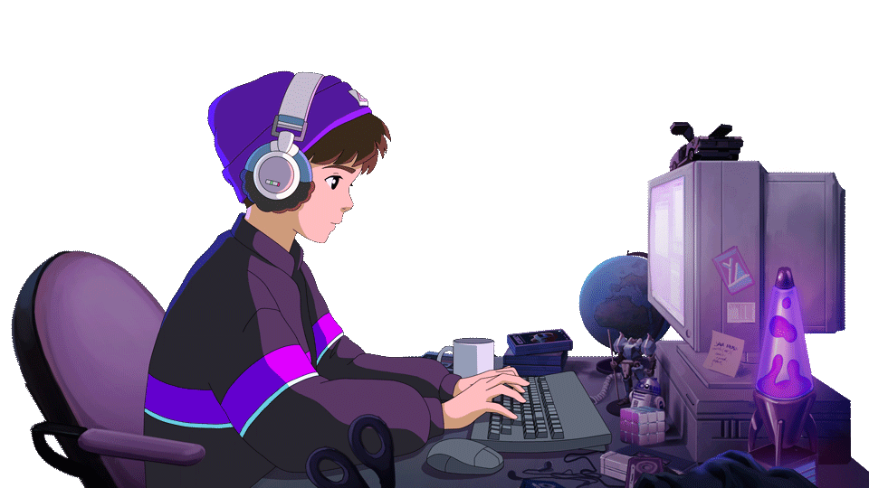

  

**It's me, Mustafa Salama!**

**ALX Software Engineering Intern**
 

<h2 align="left">About me</h2>

 
    
  &nbsp;&nbsp; • 👨🏻‍💻 I'm currently enrolled in the <strong>ALX Software Engineering internship</strong> 🚀   
  &nbsp;&nbsp; • 🌱 Still learning <strong>fundamental SWE concepts</strong> 📚   
  &nbsp;&nbsp; • 📅 Now I'm Focusing on JavaScript, jQuery, Deployment, APIs, and more in Systems Engineering/DevOps 👾 
    

  

